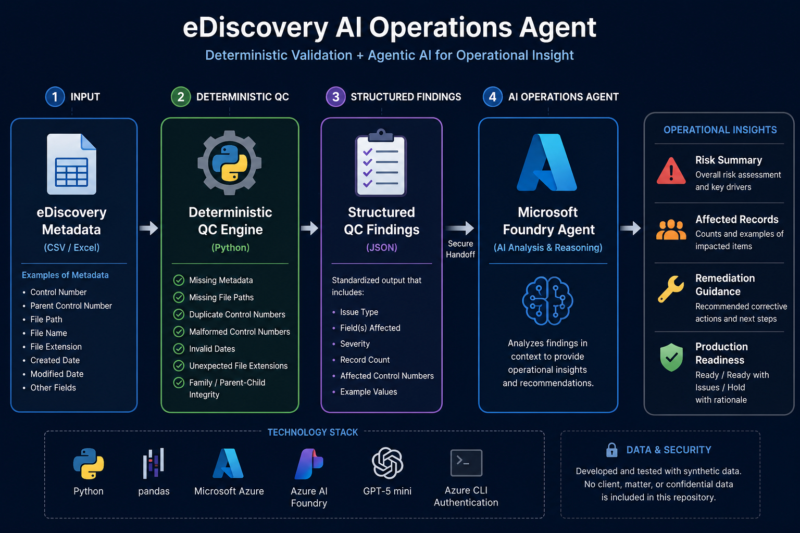
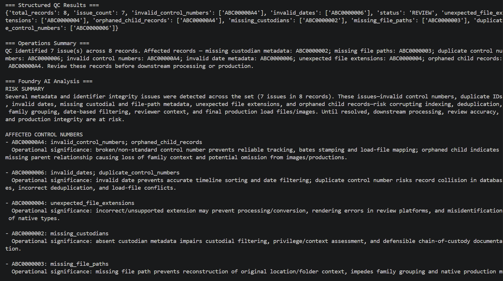

# eDiscovery AI Operations Agent

A portfolio project exploring how deterministic validation and agentic AI can be combined to support eDiscovery quality control and operational decision-making.

## Overview

The eDiscovery AI Operations Agent uses a two-layer architecture:

1. **Deterministic QC** evaluates structured metadata and identifies objective data-quality issues.
2. **Microsoft Foundry agent analysis** interprets the structured findings and provides operational risk assessment, remediation guidance, and production-readiness recommendations.

The system intentionally separates factual validation from generative reasoning.

> **Deterministic logic identifies what is wrong. AI helps reason about what to do next.**

## Architecture

## Current QC Capabilities

The prototype evaluates metadata for issues including:

- Missing required metadata
- Missing file paths
- Duplicate control numbers
- Malformed control numbers
- Invalid date metadata
- Unexpected file extensions
- Parent/child family relationship integrity

QC findings are returned as structured data before being provided to the AI layer.

## AI-Assisted Analysis

Structured QC findings are passed to a Microsoft Foundry agent configured to provide:

- Operational risk summaries
- Identification of affected records
- Recommended remediation
- Production-readiness assessment

The agent operates on the results of deterministic validation rather than being relied upon to determine whether objective metadata defects exist.

## Example Output

The following example shows the application analyzing structured QC findings generated from synthetic eDiscovery metadata.

*Example generated using synthetic test data. No client or matter data is shown.*

## Technology

- Python
- pandas
- Microsoft Foundry
- Azure AI Projects SDK
- Microsoft Azure
- GPT-5 mini
- Azure CLI authentication
- Git / GitHub

## Matter-Specific QC

eDiscovery requirements can vary significantly by matter and ESI protocol.

The architecture is being developed toward configurable, matter-specific validation rather than assuming that a single set of metadata requirements applies universally.

This approach can support variations in areas such as required metadata fields, numbering conventions, date requirements, native-file handling, family relationships, and production specifications.

## Data & Security

Development and testing use synthetic metadata only.

No client, matter, privileged, confidential, or other production eDiscovery data is included in this repository.

## Project Status

Active development and portfolio demonstration.

This repository documents the architecture and capabilities of the project. The working application and implementation are maintained separately in a private development repository.

## Source Availability

This is a public technical showcase. Core application source code is not distributed publicly.

Technical implementation and design decisions are available for discussion.
